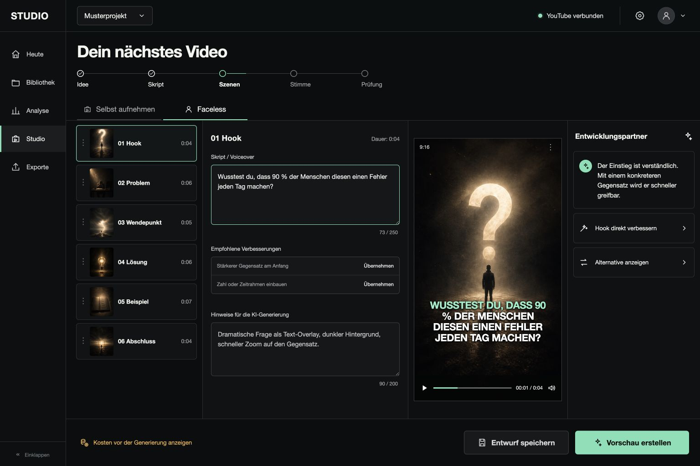

# Creator Studio MVP

Ein klickbarer, deutschsprachiger Prototyp für einen Creator-Arbeitsbereich: aus Ideen werden strukturierte Kurzvideo-Szenen, mit klaren Prüfschritten vor dem Export.



## Enthalten

- Creator-Profil mit lokaler Speicherung im Browser
- Bereiche für Heute, Bibliothek, Analyse, Studio und Exporte
- Sechs editierbare Szenen mit Bild, Skript und Generierungshinweis
- Entwicklungspartner mit übernehmbaren Textverbesserungen
- Kostenanzeige vor einer Vorschau
- Mobile Prüfliste, Freigabe und lokaler Projekt-Export als JSON

## Lokal starten

```bash
npm install
npm run dev
```

Danach die im Terminal angezeigte Adresse im Browser öffnen.

## Transparente MVP-Grenze

Dieser Stand enthält bewusst keine live verbundenen YouTube-, OpenAI-, Video- oder Stimmenanbieter. Die Oberfläche verwendet lokale Musterdaten, löst keine kostenpflichtigen AI-Aufrufe aus und erzeugt kein vorgetäuschtes MP4. Für eine Produktivversion gehören Anbieter-Zugangsdaten und Abrechnung in eine abgesicherte Server-Schicht.

## Prüfen

```bash
npm run typecheck
npm run build
```
